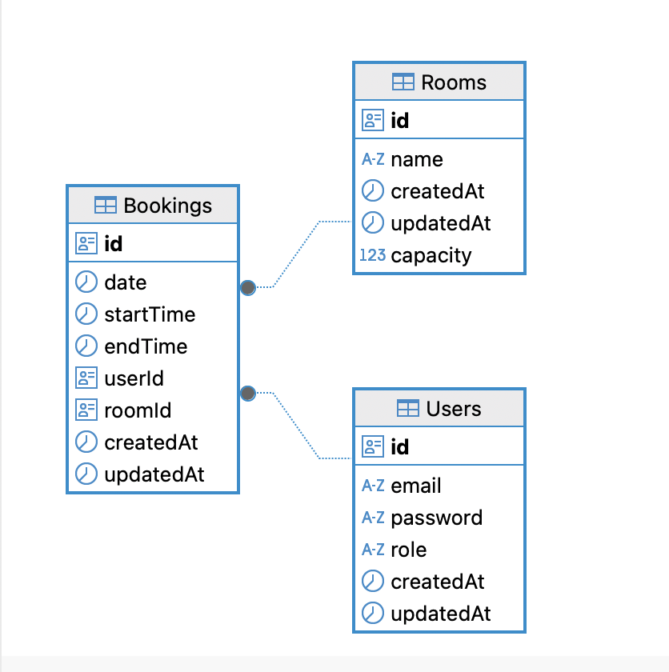

# 📖 Booking Meeting Room API (bmr-be)

An API service for managing meeting room bookings, built with **Express.js**, **TypeScript**, **MongoDB**, and **JWT Authentication**. This API is designed to be consumed by a frontend web app built with **Next.js 14**.

---

## 📦 Tech Stack

- **Node.js**
- **Express.js**
- **PostgreSQL**
- **JWT Authentication**
- **CORS**
- **dotenv**

---

## 🚀 Getting Started

### 📋 Prerequisites

- Node.js ≥ 18.x
- PostgreSQL instance (local or cloud)
- pnpm / npm / yarn

---

### 🔧 Installation

1. **Clone the repository**

```bash
git clone https://github.com/sigantengbanget/bmr-be.git
cd bmr-be
```
2. **Create a .env file**
```bash
cp .env.example .env
```

3. **Install dependencies**
```bash
pnpm install
# or
npm install
# or
yarn install
```
4. **Run the app**
```bash
pnpm dev
# or
npm run dev
# or
yarn dev
```

## Database Schema



🔐 Authentication

User authenticates via POST /api/auth/login → receives JWT token.
Token must be sent in Authorization header for protected routes:
Authorization: Bearer <your_token>

🏗️ Architecture Overview

Models: Define data schema using Sequelize and PostgreSQL.

Controllers: Handle business logic and request processing.

Routes: Define accessible endpoints.

Middlewares: For authentication, error handling, and request validation.

Utils: Reusable helpers (token generation etc).

📬 Contact
Built by sigantenggbanget
GitHub: @sigantengbanget